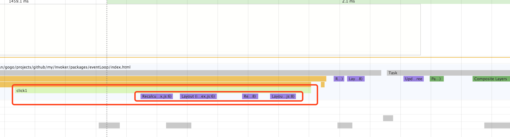

在这篇文章中[浏览器渲染流程 详细分析](https://juejin.im/entry/59f010fdf265da4315231caa)，讲到 Force Layout 这个概念，这里做一下记录。
```javascript
var con = document.getElementById('con');
con.onclick = function click1() {
  //Layout未dirty 访问domA.offsetWidth不会Force Layout
  con.style.width = (con.offsetWidth + 1) + 'px'
  //Layout已经dirty， Force Layout
  con.style.width = (con.offsetWidth + 1) + 'px'
  //Layout已经dirty， Force Layout
  con.style.width = (con.offsetWidth + 1) + 'px'
};
```


如果你在当前Layout被标记为dirty的情况下，访问了offsetTop、scrollHeight等属性，那么，浏览器会立即重新Layout，计算出此时元素正确的位置信息，以保证你在JS里获取到的offsetTop、scrollHeight等是正确的。

这一过程被称为强制重排 Force Layout，这一过程强制浏览器将本来在上述渲染流程中才执行的Layout过程前提至JS执行过程中。前提不是问题，问题在于每次你在Layout为dirty时访问会触发重排的属性，都会Force Layout，这极大的延缓了JS的执行效率。

另外，**每次重排或者强制重排后，当前Layout就不再dirty**。所以你再访问offsetWidth之类的属性，并不会再触发重排。

```javascript
// Layout未dirty 访问多少次都不会触发重排
console.log(domA.offsetWidth) 
console.log(domB.offsetWidth) 

//Layout未dirty 访问domA.offsetWidth不会Force Layout
domA.style.width = (domA.offsetWidth + 1) + 'px' 
//Layout已经dirty， Force Layout
console.log(domC.offsetWidth) 

//Layout不再dirty，不会触发重排
console.log(domA.offsetWidth) 
//Layout不再dirty，不会触发重排
console.log(domB.offsetWidth)
```