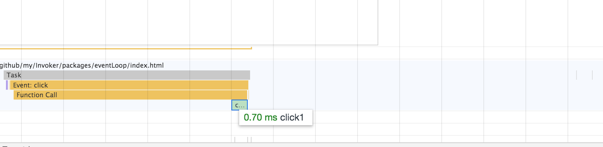
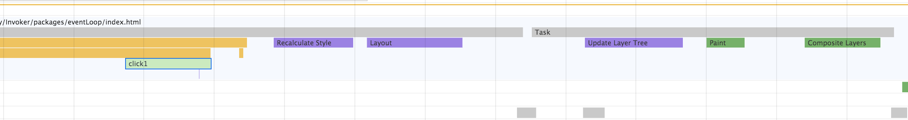
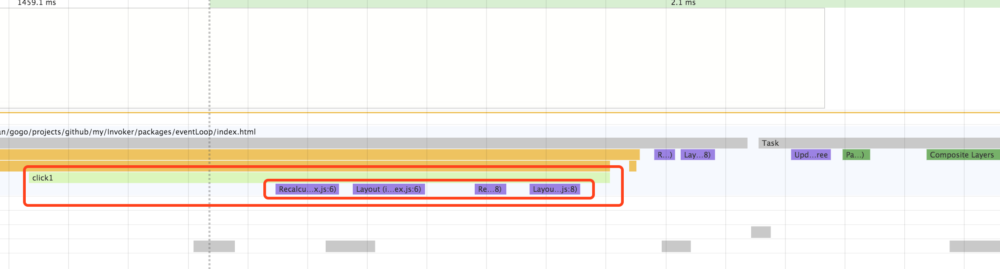
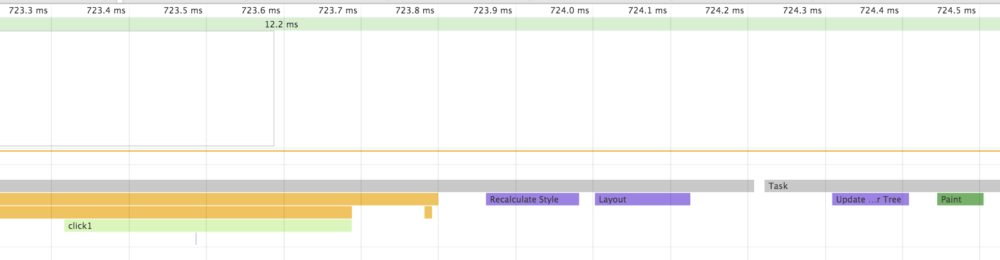
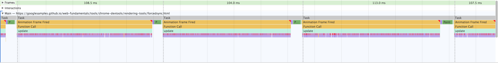
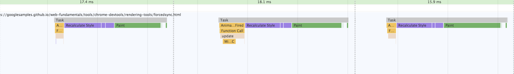

在这篇文章中[浏览器渲染流程 详细分析](https://juejin.im/entry/59f010fdf265da4315231caa)，讲到 Force Layout 这个概念，这里做一下记录。

分析如下几种情况

### 不修改样式
我们不通过 js 访问或修改任何样式，看看是个什么效果

图1


从上图可以看到，task 执行完之后，并没有渲染的过程，所以这样就是没有触发回流或重绘。

### 触发回流
修改如下规则触发回流
> - 添加或删除可见的DOM元素
> - 元素的位置发生变化
> - 元素的尺寸发生变化（包括外边距、内边框、边框大小、高度和宽度等）
> - 内容发生变化，比如文本变化或图片被另一个不同尺寸的图片所替代。
> - 页面一开始渲染的时候（这肯定避免不了）
> - 浏览器的窗口尺寸变化（因为回流是根据视口的大小来计算元素的位置和大小的）

测试代码如下：
```javascript
var con = document.getElementById('con');
con.onclick = function click1() {
  con.style.width = '10px';
  // con.style.width = '20px'
  // con.style.width = '30px'
  // con.style.width = '40px'
  // con.style.width = '50px'
};
```

图2


从上图可以看出，task 执行完以后，浏览器立刻进行了回流的操作。

那么把上面的注释去掉呢？结果还是一样的，因为浏览器进行了批处理的优化，多次回流只会执行最后一次。

### 触发强制同步布局（Force Synchronous Layout）
[What forces layout / reflow](https://gist.github.com/paulirish/5d52fb081b3570c81e3a)

测试代码如下：
```javascript
var con = document.getElementById('con');
con.onclick = function click1() {
  con.style.width = (con.offsetWidth + 1) + 'px'
  con.style.width = (con.offsetWidth + 1) + 'px'
  con.style.width = (con.offsetWidth + 1) + 'px'
};
```

图3


从上图可以看出，Recalculate Style 和 Layout 被立即触发了，导致 js 代码执行被阻塞。该如何解决这个问题呢？

```javascript
var con = document.getElementById('con');
con.onclick = function click1() {
  const offsetWidth = con.offsetWidth;
  con.style.width = (offsetWidth + 1) + 'px'
  con.style.width = (offsetWidth + 1) + 'px'
  con.style.width = (offsetWidth + 1) + 'px'
};
```

图4


从上图可以看出，这样就没有触发强制同步布局。在图3中，进行了3次回流操作，图4只有一次。

另外，值得注意的是，不是访问 offsetWidth 这些属性就会触发强制同步布局，其实它需要满足如下条件：
> 如果你对样式进行了修改，那么当前 Layout 就会被标记为 dirty 的情况，然后再访问了 offsetTop、scrollHeight 等属性，那么，浏览器才会强制同步布局。计算出此时元素正确的位置信息，以保证你在JS里获取到的 offsetTop、scrollHeight 等是正确的。**每次重排或者强制重排后，当前 Layout 就不再 dirty**。所以你再访问 offsetWidth 之类的属性，并不会再触发重排。

```javascript
// Layout未dirty 访问多少次都不会触发重排
console.log(domA.offsetWidth) 
console.log(domB.offsetWidth) 

//Layout未dirty 访问domA.offsetWidth不会Force Layout
domA.style.width = (domA.offsetWidth + 1) + 'px' 
//Layout已经dirty， Force Layout
console.log(domC.offsetWidth) 

//Layout不再dirty，不会触发重排
console.log(domA.offsetWidth) 
//Layout不再dirty，不会触发重排
console.log(domB.offsetWidth)
```

最后看一个强制同步布局的实战，[诊断强制同步布局](https://developers.google.com/web/tools/chrome-devtools/rendering-tools/forced-synchronous-layouts)

强制同步布局效果

避免强制同步布局的优化效果
