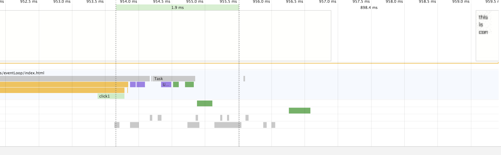
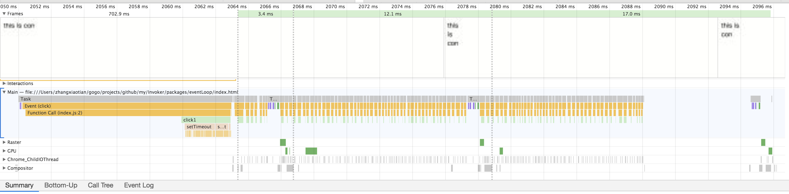

我们知道，访问和修改样式属性会触发回流，那像下面的代码会触发几次回流呢？
```javascript
var con = document.getElementById('con');
con.onclick = function click1() {
  for (var i = 0; i < 10; i++) {
    con.style.width = `${i * 10}px`;
    console.log(con.style.width);
  }
};
```

在图中可以看到，连续多次的修改 width，只触发了一次回流，可以猜测浏览器做了批处理，只更新了最后一次的样式。

---

上面是在同一个 task 里面，如果是在多个 task 里面触发回流是什么效果呢？一帧里面可以执行多少个 task 然后选择渲染呢？
```javascript
var con = document.getElementById('con');
con.onclick = function click1() {
  for (let i = 0; i < 100; i++) {
    setTimeout(function settimeout1() {
      con.style.width = i + 'px';
      console.log(con.style.width);
    }, 0);
  }
};
```

- 可以看到这100个 task 被分到了两帧里面
- 将多个回流进行了合并，在帧的默认渲染了最后一次的样式

结论：
我们知道一帧里面先执行 js 代码，最后更新样式。然后在 js 代码执行的时候，如果访问或者修改了样式，就会将它们缓存起来，最后一次更新到界面上。
