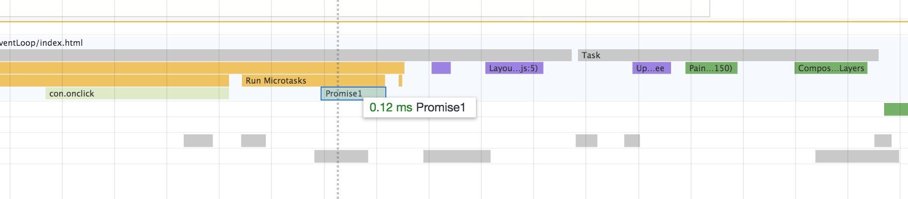

```javascript
var con = document.getElementById('con');
con.onclick = function () {
  console.log(111111)
  Promise.resolve().then(function Promise1 () {
    con.textContent = 0;
  })
};
```


由图可以看出，这一轮事件循环的 task 是 click 的回调函数，Promise1 则是 microtask