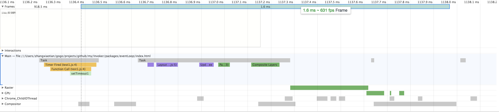

用chrome的Developer tools的Timeline查看各部分运行的时间点。
当我们点击这个div的时候，下图截取了部分时间线，**黄色部分是脚本运行，紫色部分是更新render树、计算布局，绿色部分是绘制**
```javascript
var t = 0;
var con = document.getElementById('con');
con.onclick = function () {
  setTimeout(function setTimeout1 () {
    con.textContent = t;
  }, 0)
};
```



从图中可以看到，onclick 事件在一帧之前就执行完了，setTimeout1 作为一个 task 放在这一帧里面。
