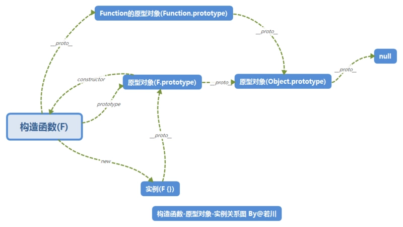
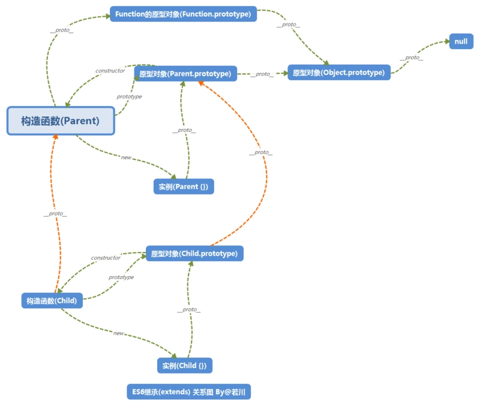

# ES6的类和继承原理浅析

下面代码输出什么？如果不清楚的话，我们接着往下看。
```javascript
class Parent {
  constructor() {
    this.name = 'tom';
    return { aa: 11 };
  }
}

class Child extends Parent {
  constructor() {
    super();
    this.age = 18;
    return { bb: 22 };
  }
}

var child = new Child();
console.log(child);
```

## 继承
继承是为了让子对象能使用父的属性和方法

- 属性：父构造函数中 this 上面的属性
- 方法：父类的静态方法，父级原型对象的方法

## 构造函数、原型对象和实例之间的关系
```javascript
function F(){}
var f = new F();
// 构造器
F.prototype.constructor === F; // true
F.__proto__ === Function.prototype; // true
Function.prototype.__proto__ === Object.prototype; // true
Object.prototype.__proto__ === null; // true

// 实例
f.__proto__ === F.prototype; // true
F.prototype.__proto__ === Object.prototype; // true
Object.prototype.__proto__ === null; // true
```




## ES6 extends 继承做了什么操作
参考：[面试官问：JS的继承](https://segmentfault.com/a/1190000018221673)

主要就是三点：
- 子类构造函数的 __proto__ 指向父类构造器，继承父类的静态方法
- 子类构造函数的 prototype 的 __proto__ 指向父类构造器的 prototype，继承父类的方法。
- 子类构造器里调用父类构造函数，继承父类的属性。

下图体现了前面两点



第一点和第二点的代码如下：
```javascript
// 寄生组合式继承的核心
function _inherits(subClass, superClass) {
    if (typeof superClass !== "function" && superClass !== null) {
        throw new TypeError("Super expression must either be null or a function");
    }
    // Object.create()方法创建一个新对象，使用现有的对象来提供新创建的对象的__proto__。 
    // 也就是说执行后 subClass.prototype.__proto__ === superClass.prototype; 这条语句为true
    subClass.prototype = Object.create(superClass && superClass.prototype, {
        constructor: {
            value: subClass,
            writable: true,
            configurable: true
        }
    });
    if (superClass) _setPrototypeOf(subClass, superClass);
}
```
执行之后的构造函数的原型链如下：
```javascript
Child(构造函数) -__proto__-> Parent -__proto__-> Function.prototype -__proto__-> Object.prototype -__proto__-> null
```
实例d的原型链如下：
```javascript
child(实例) -__proto__-> Child.prototype -__proto__-> Parent.prototype -__proto__ -> Object.prototype -__proto__-> null
```

最后就需要在子类的构造函数里面调用父类构造函数，让 this 来继承构造函数里面的属性。

ES6 的代码如下，使用 super 调用父级构造函数。
```javascript
constructor(name, age) {
  super(name);
  this.age = age;
}
```
编译后
```javascript
function Child(name, age) {
  var _this;
  _classCallCheck(this, Child);
  // Child.__proto__ => Parent
  // 所以也就是相当于Parent.call(this, name); 是super(name)的一种转换
  // _possibleConstructorReturn 判断Parent.call(this, name)函数返回值 是否为null或者函数或者对象。
  _this = _possibleConstructorReturn(this, _getPrototypeOf(Child).call(this, name));
  _this.age = age;
  return _this;
}
```

```javascript
function _possibleConstructorReturn(self, call) {
    if (!self) {
        throw new ReferenceError("this hasn't been initialised - super() hasn't been called");
    }
    return call && (typeof call === "object" || typeof call === "function") ? call : self;
}
```

值得注意的是，`new Child()`出来的对象，会存在下面三种情况，这里按照优先级从高到低排列。
1. 如果 Child 构造函数的返回值是对象或者函数，就用此返回值作为 new 出来的对象
2. 如果 Parent 构造函数的返回值是对象或者函数，就用此返回值作为 new 出来的对象，并且要添加上 Child 构造函数中 this 上面的属性
3. 如果所有构造函数都没有返回值，由 new 关键字产生的新对象，作为返回值。

所以，最开始的代码，输出为`{ bb: 22 }`，因为满足了上面第一种情况。


